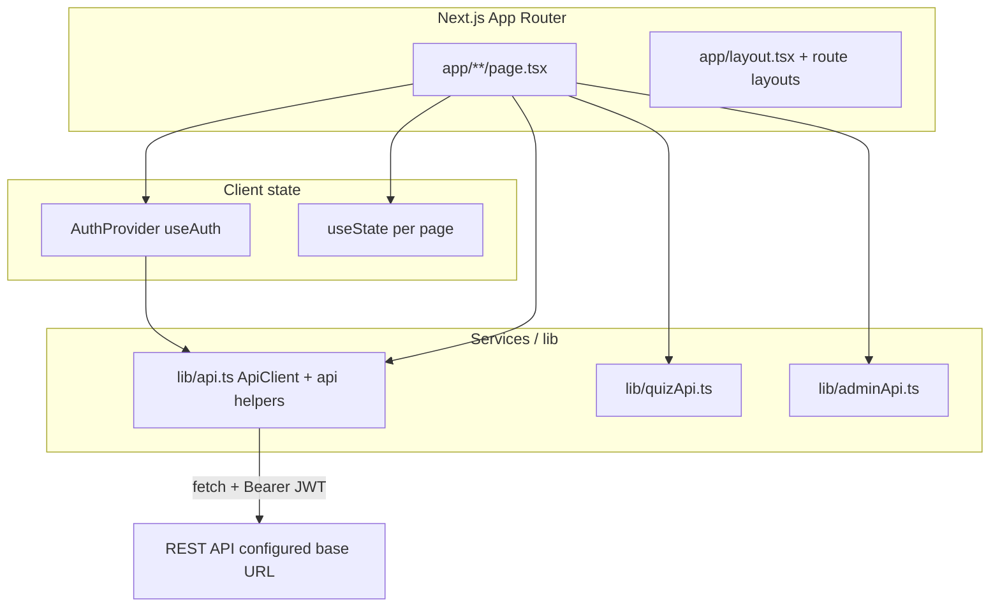
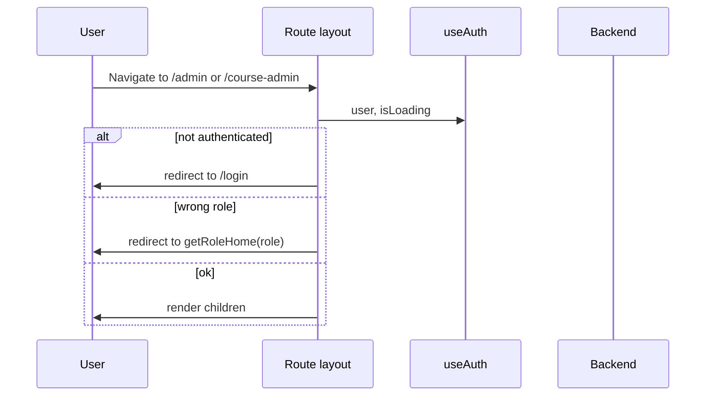
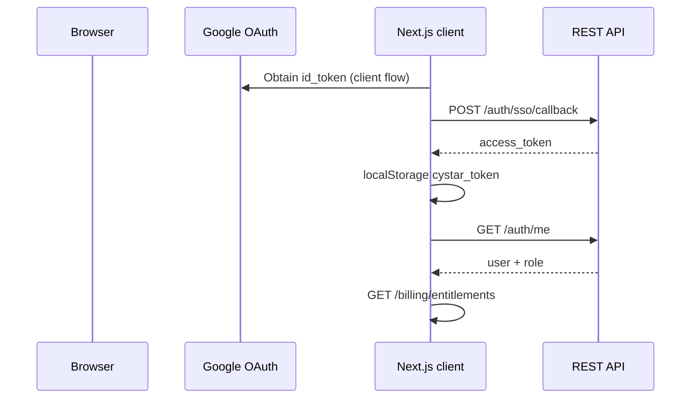

# RangeOps Web Portal — Frontend Documentation

**Application:** RangeOps by DeepTrustxAI Academy (Next.js app in this monorepo’s `Frontend/` folder)  
**One line:** A role-aware web client for cyber-range labs, commerce, workshops, and platform administration.  
**Overview:** Built with **Next.js 15 (App Router)** and **React 19**, the app consumes a REST API over HTTPS, uses **JWT** in the `Authorization` header, and splits the experience across **learner**, **course admin**, and **system admin** surfaces. UI is **Tailwind CSS v4**–first with a **Radix UI**–based component system and a custom dark theme in `app/globals.css`.

---

## Frontend preview

> **Placeholders for GitHub** — add images under `docs/screenshots/` or `.github/` and reference them here.

| Slot | Suggested capture |
|------|-------------------|
| Hero / home | `/` with CMS-driven hero when authenticated vs guest |
| Labs catalog | `/labs` with entitlements and pricing |
| Dashboard | `/dashboard` with active lab sessions |
| Purchase | `/purchase/[id]` checkout flow (test mode) |
| Quiz | `/quiz/[id]` challenge view |
| Course admin | `/course-admin` cohort list; `/course-admin/cohorts/[id]` roster |
| System admin | `/admin` overview; `/admin/ops/feed`; `/admin/courses` |
| Mobile | Same key pages at ~390px width |

```markdown
<!-- Example after you add files -->

```

---

## Tech stack

| Category | Technology | Notes (from codebase) |
|----------|------------|-------------------------|
| Framework | **Next.js 15.2.4** | App Router (`app/`) |
| Language | **TypeScript 5** | `strict: true` in `tsconfig.json` |
| State management | **React Context** | `AuthProvider` (`lib/auth-provider.tsx`); no Redux/Zustand |
| Routing | **Next.js file-based routing** | `app/**/page.tsx` |
| Styling | **Tailwind CSS v4** | `@import 'tailwindcss'` in `app/globals.css`; PostCSS `@tailwindcss/postcss` |
| UI libraries | **Radix UI** primitives | Under `components/ui/*` |
| Component patterns | **CVA**, **clsx**, **tailwind-merge** | `lib/utils.ts` (`cn`) |
| Forms / validation | **react-hook-form**, **@hookform/resolvers**, **zod** | `lib/validation/` |
| Charts | **Recharts** | `recharts` + `components/ui/chart.tsx` |
| Rich text | **Quill** (`react-quill`, `quill`) | CMS/editor flows where needed |
| Icons | **lucide-react** | Headers, nav, actions |
| Notifications (toast) | **Sonner** + custom `components/toast.tsx` | Root layout wraps `ToastContainer` in `ClientOnly` |
| Theming (optional) | **next-themes** | `components/theme-provider.tsx` exists |
| Authentication | **Google SSO** + **dev-only** token endpoints | `api.ssoCallback`, `api.devLogin*`, token in `localStorage` |
| API handling | **Native `fetch`** | `ApiClient` in `lib/api.ts` (not Axios) |
| Build | **Next.js** (`next build` / `next start`) | |
| Lint | **ESLint 9** + **eslint-config-next** | |
| Testing | *Not configured* | No `test` script or testing deps in `package.json` |
| HTML sanitization (dependency) | **dompurify** | In `package.json`; no broad `DOMPurify` usage across app TS/TSX (`dangerouslySetInnerHTML` appears in `components/ui/chart.tsx` for chart theming) |

---

## Frontend features

| Feature | Description | Status |
|---------|-------------|--------|
| Google SSO login | Exchanges Google `id_token` for API JWT via `POST /auth/sso/callback` | Implemented (`lib/auth-provider.tsx`, `login`) |
| Dev login | Admin / participant dev token endpoints for local testing | Implemented (backend must restrict in production) |
| Session profile | `GET /auth/me` drives `user` and `role` | Implemented |
| Entitlements | `GET /billing/entitlements` cached in auth context | Implemented |
| Lab catalog | Backend catalog (`GET /catalog/labs`) on labs flow | Implemented |
| Lab dashboard | Deployments status, join, VPN/AWS helpers | Implemented |
| Razorpay checkout | Client-side checkout + verify-capture fallback | Implemented (`lib/razorpay.ts`, purchase pages) |
| Quizzes | Flag submission, progress, leaderboard via `lib/quizApi.ts` | Implemented |
| CMS / legal pages | Content from Content Studio API; about/terms/refund | Implemented |
| Workshop invites | Invite link, redeem, complete flow | Implemented |
| Course admin workspace | Cohorts, labs, invites, runs (`lib/api.ts` helpers) | Implemented |
| System admin workspace | Ops, users, courses, content studio, guardrails, billing views | Implemented |
| Operations feed | List/read/ack/workflow for ops items | Implemented |
| Notifications bell | User notifications from API | Implemented |
| Error boundary component | Class component + logger | Present; **not mounted** in `app/layout.tsx` |
| Theme provider | `next-themes` wrapper | Present; **not mounted** in root layout |
| Lab context | `LabProvider` / `useLabs` | **Defined** in `lib/labContext.tsx`; **not used** elsewhere in this package |
| E2E / unit tests | Automated test runner | **Not present** in `package.json` |
| Light / system theme toggle | Would require `ThemeProvider` in tree | **Incomplete** (component file only) |

---

## UI/UX overview

- **Design approach:** Dark-first “cyber” palette via CSS variables in `app/globals.css`; cards, borders, and focus rings align with shadcn-style tokens (`--background`, `--foreground`, etc.).
- **User flow:** Marketing home → register/login → SSO → redirect by `role` (`lib/role-home.ts`) → learner dashboard, `/course-admin`, or `/admin`.
- **Navigation:** `Header` for public/marketing areas; dedicated **sidebar layouts** for `/admin` and `/course-admin` with active-route highlighting (`useMemo` on pathname).
- **Responsive behavior:** Tailwind breakpoints; `components/ui/use-mobile.tsx` and `hooks/use-mobile.ts` support responsive patterns.
- **Accessibility:** Radix primitives provide focus management and ARIA for many controls; **no dedicated a11y test suite** in this package.
- **Component architecture:** Feature components in `components/`; generic primitives in `components/ui/`.

---

## Application architecture



- **Folder structure:** `app/` routes and layouts; `components/` UI and features; `lib/` API, auth, validation, utilities; `hooks/` shared hooks; `public/` static assets.
- **State flow:** Global auth + entitlements in context; pages hold view-specific state and call `api.*` / `apiClient`.
- **API communication:** Single `ApiClient` with `request()` wrapper: JSON body, timeout via `AbortController` (~30s default), structured `ApiResponse` (`success`, `message`, `data`).
- **Authentication flow:** Token in `localStorage` (`cystar_token`); loaded into `ApiClient` on init; `Authorization: Bearer` on requests; logout clears storage and calls API logout where applicable.
- **Protected routes:** **Layout-level** checks in `app/admin/layout.tsx` and `app/course-admin/layout.tsx` (redirect if wrong role / not authenticated).
- **Data handling:** Server state fetched in `useEffect` or event handlers; lists filtered with `useMemo` on several heavy pages.

### Protected route logic (conceptual)



---

## Folder structure

```
Frontend/
├── app/                    # Next.js App Router: pages, layouts, global CSS
│   ├── layout.tsx          # Root: AuthProvider, footer gate, toasts
│   ├── globals.css         # Tailwind + theme tokens
│   ├── page.tsx            # Home
│   ├── login/, register/, dashboard/, labs/, …
│   ├── admin/              # sys_admin shell + nested routes
│   └── course-admin/       # course_admin shell + cohorts/labs
├── components/             # Feature + shared UI
│   ├── ui/                 # Radix-based primitives
│   ├── admin/              # Admin-specific modals/sidebars
│   ├── Header.tsx, SiteFooter*.tsx, …
│   └── ErrorBoundary.tsx
├── hooks/                  # use-mobile, use-toast
├── lib/
│   ├── api.ts              # Main API client + typed helpers
│   ├── auth-provider.tsx   # Auth context implementation
│   ├── auth.ts             # Re-exports AuthProvider / useAuth
│   ├── quizApi.ts          # Quiz endpoints
│   ├── adminApi.ts         # Legacy-style admin HTTP helpers
│   ├── validation/         # zod schemas + helpers
│   ├── razorpay.ts         # Checkout script loading
│   ├── logger.ts           # Logging + optional remote endpoint
│   └── …                   # role-home, content-id, date utils, etc.
├── public/                 # Static files (placeholder assets)
├── next.config.mjs
├── postcss.config.mjs
├── tsconfig.json
└── package.json
```

---

## Routing structure

### Public routes

| Route | Purpose |
|-------|---------|
| `/` | Landing / CMS-driven sections |
| `/about`, `/terms`, `/privacy`, `/refund` | CMS-backed or static legal/info |
| `/labs` | Lab catalog and access entry |
| `/login`, `/register` | Auth entry (SSO-centric) |
| `/purchase/[id]`, `/purchase/success` | Checkout |
| `/quiz/[id]` | Quiz experience |
| `/course-invite`, `/course-invite/complete` | Workshop invite redemption |
| `/test-api` | Dev connectivity page |

### Authenticated learner

| Route | Purpose |
|-------|---------|
| `/dashboard` | Personal dashboard, lab status |

### Course admin (`course_admin`)

| Route | Purpose |
|-------|---------|
| `/course-admin` | Operator home |
| `/course-admin/cohorts/[cohortId]` | Cohort operations |
| `/course-admin/labs/[contentId]` | Lab delivery for a content item |
| `/course-admin/[id]` | Legacy redirect → labs route |
| `/course-admin/workshops`, `/course-admin/workshops/[workshopId]` | Legacy redirects |

### System admin (`sys_admin`)

| Prefix | Purpose |
|--------|---------|
| `/admin` | Overview |
| `/admin/ops/*` | Individual ops, workshop ops, deployments, users, feed |
| `/admin/users`, `/admin/participants`, `/admin/course-admins` | Accounts / access |
| `/admin/courses`, `/admin/guardrails`, `/admin/deployments`, `/admin/labs`, `/admin/quizzes` | Catalog and operations |
| `/admin/content`, `/admin/content/[pageId]` | Content Studio |
| `/admin/billing`, `/admin/billing/payments` | Billing views |

---

## Components documentation

| Area | Location | Role |
|------|----------|------|
| Shared layout chrome | `Header.tsx`, `SiteFooter.tsx`, `SiteFooterGate.tsx` | Marketing navigation and conditional footer |
| Auth / VPN / labs | `VpnKeyManager.tsx`, `AwsCodeEntry.tsx`, `CrapiAccessBox.tsx`, `ActiveLabSessionsCard.tsx` | Lab access UX |
| Modals | `UserCredentialsModal.tsx`, `components/admin/*Modal.tsx` | Focused workflows |
| Notifications | `NotificationBell.tsx` | Load notifications |
| Reusable UI | `components/ui/*` | Buttons, forms, tables, dialogs, charts |
| Toasts | `components/toast.tsx`, `components/ui/sonner.tsx` | User feedback |
| Client-only wrapper | `client-only.tsx` | Avoid SSR issues for client-only widgets |

---

## State management

| Layer | Implementation |
|-------|------------------|
| Global | `AuthProvider`: `user`, `entitlements`, `isLoading`, auth methods (`lib/auth-provider.tsx`) |
| Global (unused) | `LabProvider` in `lib/labContext.tsx` — not referenced by layouts/pages |
| Local | Component `useState` / `useRef` / `useCallback` on large admin/course-admin pages |
| Data fetching | Imperative `async` functions; no React Query / SWR in `package.json` |

---

## API integration

| Topic | Implementation |
|-------|------------------|
| Service layout | `lib/api.ts`: class `ApiClient` + exported `api` object + raw `apiClient` |
| HTTP | `fetch()` with JSON `Content-Type` |
| Base URL | **Client:** if host is `localhost` / `127.0.0.1` → `http://localhost:8000`; else `http://{hostname}:8000`. **Server:** `process.env.NEXT_PUBLIC_API_URL` or default `http://localhost:8000`. |
| Token | `localStorage` key `cystar_token`; `setToken` / `clearToken`; `refreshToken()` reloads from storage |
| Errors | Non-OK responses parsed to `ApiResponse`; selective handling for known benign cases in `request()` |
| Timeouts | `AbortController` default **30s** unless overridden |
| Quiz | `lib/quizApi.ts` uses `apiClient.get/post/put` |
| Legacy admin | `lib/adminApi.ts` wraps `apiClient` |

Exact path strings live in `lib/api.ts`, `lib/adminApi.ts`, and `lib/quizApi.ts`. This document does not duplicate every endpoint.

---

## Styling system

- **Tailwind v4** via CSS import and `@tailwindcss/postcss`.
- **Theme:** CSS variables for colors, radii, fonts; dark-first RangeOps branding in `app/globals.css`.
- **Consistency:** Shared `cn()` in `lib/utils.ts`; Radix + Tailwind in `components/ui`.

---

## Authentication flow



- **Email/password:** `ApiClient.login` / `register` return a fixed “disabled / SSO required” response — not a live password flow in this codebase.
- **Logout:** clears client storage (including Razorpay-related cache in `apiClient`) and calls backend logout via `api.logout()` when used.
- **Protected routes:** enforced in admin/course-admin layouts using `useAuth` + `getRoleHome`.

---

## Environment variables

| Variable | Purpose | Required |
|----------|---------|----------|
| `NEXT_PUBLIC_API_URL` | API base URL on server / fallback | Optional locally (client infers LAN URL) |
| `NEXT_PUBLIC_GOOGLE_CLIENT_ID` | Google OAuth client ID | Required where SSO is used |
| `NEXT_PUBLIC_RAZORPAY_KEY_ID` | Razorpay Checkout | Required for checkout |
| `NEXT_PUBLIC_CRAPI_URL` | Lab CRAPI base link in VPN/lab UI | Optional (components may use defaults) |
| `NEXT_PUBLIC_LOGGING_ENDPOINT` | Optional client log / error beacon URL | Optional |

Never commit real `.env.local` secrets.

---

## Installation and setup

**Prerequisites:** Node.js compatible with Next 15; npm (or align with your lockfile).

```bash
cd Frontend
npm install
```

Create **`.env.local`** with the variables from the table above.

**Development:**

```bash
npm run dev
```

Default: **127.0.0.1:18080**. Alternatives: `npm run dev:lan`, `npm run dev:windows`.

**Production:**

```bash
npm run build
npm run start
```

---

## Available scripts

| Script | Command | Description |
|--------|---------|-------------|
| `dev` | `next dev -H 127.0.0.1 -p 18080` | Local dev |
| `dev:lan` | `next dev -H 0.0.0.0 -p 18080` | All interfaces |
| `dev:windows` | `next dev -H 127.0.0.1 -p 3000` | Alternate port |
| `build` | `next build` | Production build |
| `start` | `next start` | Production server |
| `lint` | `next lint` | ESLint |

---

## Performance optimizations

| Technique | Status in codebase |
|-----------|-------------------|
| Next.js route-based code splitting | Default App Router behavior |
| `useMemo` for derived lists/metrics | Used on multiple admin/course-admin pages |
| `next/dynamic` lazy imports | Not broadly adopted; can be added for heavy editors |
| Images | `next.config.mjs` sets `images.unoptimized: true` |
| Caching / SWR / React Query | Not used |
| Bundle analysis | Not configured in `package.json` |

---

## Security considerations

| Topic | Notes |
|-------|------|
| XSS | Prefer React text rendering; `dangerouslySetInnerHTML` in `components/ui/chart.tsx` for chart script — keep data trusted. |
| Token storage | **localStorage** — XSS-sensitive; use CSP and dependency hygiene in production. |
| API transport | HTTPS assumed in production; dev may use HTTP per config. |
| Route protection | UI-level; server must always enforce authorization. |
| Logging | `logger` redacts simple token/password patterns before optional remote reporting. |

---

## Responsive design

| Intent | Support |
|--------|---------|
| Mobile | Tailwind responsive classes + `use-mobile` where used |
| Tablet / desktop | Primary layouts target desktop-style admin tables |
| Large screens | Max-width containers (e.g. `Header` `max-w-6xl`) |

Some admin tables are dense; expect horizontal scroll on small viewports unless improved.

---

## Testing

| Item | Status |
|------|--------|
| Unit / integration | No Jest/Vitest/Testing Library in `package.json` |
| `npm test` | Not defined |
| Manual | `app/test-api` for dev health checks |

---

## Deployment

| Item | Guidance |
|------|----------|
| Platform | Compatible with Vercel, Node Docker, or any host running `next start` |
| Build | `npm run build` |
| Env | Set all `NEXT_PUBLIC_*` for the target environment |
| `next.config.mjs` | `allowedDevOrigins` lists dev LAN origins; review for production |
| Build strictness | `typescript.ignoreBuildErrors` and `eslint.ignoreDuringBuilds` are **enabled** — weakens CI gates |

---

## Known issues / limitations

1. **`package.json` `name`** is still `my-v0-project` — consider renaming for publishing.
2. **Build ignores TypeScript and ESLint errors** — risky for production CI.
3. **No automated tests** in the package manifest.
4. **`LabProvider`**, **`ThemeProvider`**, **`ErrorBoundary`** exist but are **not integrated** in `app/layout.tsx`.
5. **Client base URL** infers `http://{hostname}:8000` on LAN — document for split-domain or HTTPS API setups.
6. **`dompurify`** is not centralized as a shared sanitizer across the app.

---

## Future improvements / roadmap

- Add **`.env.example`** and document required vs optional vars.
- Enable **strict CI** after clearing `ignoreBuildErrors` / `ignoreDuringBuilds` debt.
- Introduce **React Query** or **SWR** for cache and deduplication.
- **Wire `ErrorBoundary`** around major subtrees.
- **Remove or integrate** `LabProvider` / `ThemeProvider`.
- Add **Playwright** for SSO + checkout + admin smoke paths.
- **Bundle analyzer** and lazy-load **Quill** / heavy admin routes.
- Revisit **`images.unoptimized`** if adopting optimized `next/image`.

---

## Contributing guidelines

1. Match existing patterns in `app/` and `lib/api.ts`.
2. Keep **role checks** consistent with `getRoleHome` and route layouts.
3. Avoid new global state libraries without team agreement.
4. Run **`npm run lint`** before PRs.
5. Update **this document** when adding routes, env vars, or major components.

---

## License

No `LICENSE` file exists inside `Frontend/`. Add a license at monorepo root or here per your organisation.

---

## Credits

- **UI foundation:** Radix UI, shadcn-style patterns, Tailwind CSS.
- **Product naming:** `app/layout.tsx` metadata references **RangeOps by DeepTrustxAI Academy**.

---

## Appendix — Improvement suggestions

**Architecture:** Single documented API base URL strategy for SSR vs client; consider consolidating `adminApi.ts` with `api` helpers.

**Components:** Mount `ErrorBoundary` on admin/course-admin; extract repeated page headers and empty states.

**Performance:** Lazy-load Quill and very large pages; optional bundle analyzer; reconsider `images.unoptimized`.

**UI/UX:** Mobile pass on dense tables; loading skeletons; optional light theme if `ThemeProvider` is wired.

**Best practices:** Automated tests and CI typecheck/lint gates; `.env.example`; periodic a11y audit; CSP at the host.
