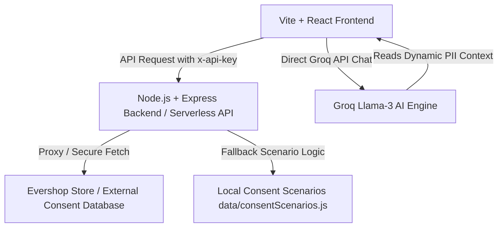

# Data Discovery & Consent Management System (DDS-CMS)
## Professor Presentation & Viva-Voce Prep Guide

This document is a comprehensive, step-by-step guide designed to help you present the **Data Discovery & Consent Management System (DDS-CMS)** to your professor. It explains the purpose, internal mechanics, mathematical calculations, and future roadmap for every single section of the dashboard in both **Plain English (Layman's terms)** and **Technical Architecture (Developer details)**.

---

## High-Level System Architecture

Before diving into individual tabs, here is how the entire system is put together:



### 1. The Frontend (Vite + React)
- **Role**: Serves the user interface (dashboard shell, charts, forms, and AI chat assistant).
- **Core Technologies**: React (Functional Components, Hooks like `useMemo`, `useState`, `useEffect`), Recharts (data visualizations), Lucide-React (icons).

### 2. The Backend (Node.js + Express)
- **Role**: Secure API proxy that handles authorization, filters columns, executes server-side metrics calculations, and triggers PII classification securely without exposing private database credentials to the browser client (resolving CORS issues).
- **Key Endpoints**:
  - `/api/consents`: Retrieves the raw consent records.
  - `/api/pii-results`: Automatically parses consent entries to classify active PII schemas.
  - `/api/pii-risk-details`: Generates dynamic risk assessment details based on active database fields.
  - `/api/pull-and-classify`: Simulates/triggers scanning of the database.

---

## Module 1: API Key Connection & Persistence

### A. Explain to a Layman (Why it is there & What it does)
Imagine you are an auditor walking into a business. You cannot inspect their compliance if you cannot see their data. The **Consent API Key box** at the top acts as a secure digital keycard. By entering an API key (like `dds_ecom_live_key_001` or mock keys), you connect the dashboard to a specific database of user consents.
- **Persistence**: We use the browser's secure memory (`localStorage`). When the user inputs the key, it is saved locally. If they navigate away, refresh the page, or close the browser, the key persists so they do not have to copy-paste it every single time.

### B. Technical Implementation (How it works & Code flow)
- **State Initialization**: The `apiKey` and `activeApiKey` states in `Dashboard.jsx` are initialized using a lazy initializer function that queries `localStorage`:
  ```javascript
  const [apiKey, setApiKey] = useState(() => localStorage.getItem("ddsActiveApiKey") || "");
  ```
- **Sync Event Flow**:
  1. User inputs a key and clicks **Sync**.
  2. `handleApiKeySubmit` intercepts the event, trims whitespace, sets `activeApiKey`, and stores the key in `localStorage` under `ddsActiveApiKey`.
  3. The `useEffect` listening to `[activeApiKey]` fires. It sets `loading` to true and issues a fetch request to `/api/consents` with custom request headers:
     ```javascript
     headers: { "x-api-key": activeApiKey }
     ```
  4. The backend checks if the key matches a live database connection (e.g. an EverShop PostgreSQL schema) or falls back to custom static test scenarios.

### C. Future Roadmap & Improvements
- **Role-based API Keys**: Generate keys with different permission levels (e.g., `read-only` for compliance auditors, `read-write` for system admins).
- **Key Rotation**: Implement automatic expiration and rotation of tokens to safeguard database access.

---

## Module 2: The Overview Tab

### A. Explain to a Layman (Why it is there & What it does)
The **Overview Tab** is the executive summary (C-Suite view) of the company's privacy posture. Instead of forcing a manager or regulator to parse thousands of raw database lines, this tab shows four clickable high-level performance cards (Consent Management, DPDP Gap Review, PII Mapping, and DPIA Assessment) and the overall compliance score.
- It acts like a report card, showing quick grade percentages (e.g., 90% - Excellent, 50% - Needs Action).

### B. Technical Implementation (How it works & Code flow)
- **Component**: `ReadinessModules.jsx`
- **Metrics Calculation**:
  - Dynamically calculates the four scores using the utility `calculateReadinessScores` in `readinessScores.js`.
  - Uses reactive class styling to change color tones (`excellent` -> green, `good` -> blue, `needs-action` -> yellow, `critical` -> red) based on numerical scores.
  - Clicking any card dynamically sets the state variable `activeTab` to the corresponding page, enabling smooth internal navigation.

### C. Future Roadmap & Improvements
- **Trend Timelines**: Add a small sparkline chart inside each card to show compliance progress over the last 30 days.
- **Push Alerts**: Enable email or Slack alerts if a card's readiness drops below a critical threshold (e.g. if the revocation rate surges).

---

## Module 3: The Consent Tab & Analytics

### A. Explain to a Layman (Why it is there & What it does)
Under the DPDP Act, companies can only collect user data if they have explicit permission (consent). The **Consent Tab** is the control panel to monitor these permissions.
- **KPI Metrics**: Shows the total number of users, how many said "Yes" (Granted), how many said "No" or withdrew (Revoked), and the current Revocation Rate.
- **Visual Charts**: Interactive pie charts and bar charts break down these numbers by purpose (e.g., Marketing, Research, Analytics).
- **Search & Filter**: Allows you to instantly search for a user by name/ID or filter the view.
- **CSV Export**: Lets compliance officers download the active list as a spreadsheet for audits.

### B. Technical Implementation (How it works & Code flow)
- **Data Hooking**: Uses `useMemo` hooks to filter data in real-time as the user types or selects a purpose:
  ```javascript
  const filteredConsents = useMemo(() => filterConsents(consents, purpose, searchTerm), [consents, purpose, searchTerm]);
  const kpis = useMemo(() => calculateKpis(filteredConsents), [filteredConsents]);
  ```
- **Visualizations**: Built with Recharts. It feeds `statusData` (pie chart array containing granted and revoked counts) and `purposeData` (bar chart array showing grouped items) into `<ResponsiveContainer>` elements.
- **Recent Revocations sorting**: The table only maps records where `consent_status === "revoked"`. It sorts them in descending order by converting timestamps to Unix epoch values, ensuring the most recent revocations appear at the top.
- **CSV Export Logic**:
  - `toCsv` in `consentMetrics.js` parses the filtered records.
  - It builds a comma-separated string header and appends rows.
  - The browser generates an in-memory download link (`URL.createObjectURL(blob)`) to download `consent-dashboard-data.csv`.

### C. Future Roadmap & Improvements
- **Granular Revocation Channels**: Track *how* the user withdrew consent (e.g., website, mobile app, offline support call).
- **Consent Age Distribution**: Map how long users remain subscribed before they choose to revoke.

---

## Module 4: DPDP Score & Regulatory Compliance

### A. Explain to a Layman (Why it is there & What it does)
This is the heart of the regulatory framework. The **DPDP Score** checks the data against the **10 core requirements** of India's DPDP Act, 2023.
- If the company is missing critical fields (like timestamps, user details, or notice records), the system deducts points.
- If everything is perfectly captured, it awards full points.
- This tells the professor and auditors exactly how close the company is to a perfect compliance standard, complete with references to the actual legal sections of the Act.

### B. Technical Implementation (How it works & Code flow)
- **Component**: `DpdpComplianceOverview.jsx`
- **Formulas & Weights**: Computed inside `dpdpCompliance.js`.
  1. **Base metrics** extract indicators like *Timestamp Coverage*, *Notice Coverage*, and *Contact Coverage*.
  2. **Rule Grading**: Each of the 10 rules checks specific combinations of base metrics and is assigned one of four statuses:
     - **Excellent** ($\ge 85\%$): Status Value = `1.0`
     - **Good** ($\ge 70\%$ but $< 85\%$): Status Value = `0.5`
     - **Needs Action** ($\ge 40\%$ but $< 70\%$): Status Value = `0.0`
     - **Critical** ($< 40\%$): Status Value = `-0.5` (deducts points)
  3. **Overall Calculation**:
     $$\text{Overall DPDP Score} = \left( \frac{\sum (\text{Rule Weight}_i \times \text{Status Value}_i)}{\sum \text{Rule Weight}_i} \right) \times 100$$
  4. This value is clamped between `0` and `100` and represented as a dynamic CSS conic-gradient ring:
     ```css
     background: conic-gradient(var(--score-color) var(--score), transparent var(--score));
     ```

#### DPDP Statutory Mappings:
- **Rule 1: Consent Management** (Sec. 6) - Verifies completeness of consent agreements.
- **Rule 2: Notice & Transparency** (Sec. 5) - Assesses presence of explicit notice purpose labels.
- **Rule 3: Right to Withdraw** (Sec. 6(4) & 11) - Assesses whether revoked records retain traceable timestamps.
- **Rule 4: Erasure Timelines** (Sec. 12) - Verifies valid timestamps exist to calculate data retention/erasure.
- **Rule 5: Grievance Redressal** (Sec. 13) - Verifies contact details (email or phone) are mapped to support data principal queries.

### C. Future Roadmap & Improvements
- **Upload Compliance Certificate**: Allow companies to upload verified regulatory audit audits directly.
- **Drill-down Analytics**: Clicking a compliance rule could open a detailed list showing exactly which database records failed that rule.

---

## Module 5: PII Mapping & Classification

### A. Explain to a Layman (Why it is there & What it does)
**PII (Personally Identifiable Information)** is any data that can identify an individual (e.g., name, phone number, email, address). Under DPDP, this data is high-risk.
- The **PII Mapping Tab** scans the database columns, finds columns holding personal details, and categorizes them.
- It displays the database table, the column name, whether it is PII, what type of PII it is (e.g. Full Name), and the risk level (Low, Medium, High).
- **No Hardcoded Sample Data**: To guarantee user privacy and prevent data leaks, we removed the "Sample Value" column. A security auditor or professor will appreciate this design decision because real personal data (like John Doe's phone number) must never be displayed on a general admin reporting dashboard.

### B. Technical Implementation (How it works & Code flow)
- **Component**: `PiiMapping.jsx`
- **Backend Flow**:
  1. Triggered by clicking the **Classify** button. The frontend invokes `/api/pull-and-classify`.
  2. The server pulls consents from the active source and executes `getPiiResultsFromConsents` inside `consentScenarios.js`.
  3. It analyzes key keys in the JSON records. For example, if a column is named `name`, it classifies it as PII Type: `Full Name` and Risk: `Medium`.
  4. Returns the classification list *without* attaching raw database cell values to enforce data minimization.

### C. Future Roadmap & Improvements
- **Regex-based Scanner**: Build a deep pattern scanner that can read raw SQL/NoSQL fields and auto-detect unstructured PII (like a phone number written in a text comment field).
- **Field Encryption Status**: Map which columns in the physical database are encrypted at rest.

---

## Module 6: DPIA Assessment & AI Assistant

### A. Explain to a Layman (Why it is there & What it does)
A **DPIA (Data Protection Impact Assessment)** is a mandatory legal assessment that companies must perform under DPDP rules for high-risk data. It is a long, tedious process.
- The **DPIA Entry Tab** features an **AI Privacy Assistant**.
- The AI dynamically loads the company's active PII fields (what data we collect) and risk profiles.
- It chats with the user, asking targeted questions (e.g., "Where is this address data stored?" or "What encryption is used on your email columns?").
- Once the conversation finishes, the user can download a fully populated, professional DPDP Compliance Report in Markdown format.

### B. Technical Implementation (How it works & Code flow)
- **Component**: `DpiaEntry.jsx`
- **Dynamic Context Loading**:
  - The component fetches `/api/pii-risk-details` from the server, passing the active API key.
  - The response returns a list of fields, storage locations, and encryption protocols derived from the active PII mapping database.
- **AI Integration**:
  - It connects to **Groq's Llama-3 API** (using the client's Groq API Key).
  - **Dynamic System Prompt**: The system instructions are dynamically generated, embedding the active PII configuration:
    ```javascript
    const systemPrompt = {
      role: "system",
      content: `You are an AI assistant helping a company generate a DPDP compliance report... Here are the PII risk details: ${JSON.stringify(piiData)}...`
    };
    ```
  - As the user types responses, the conversation history is appended to `messages` and passed back to Llama-3.

### C. Future Roadmap & Improvements
- **Local LLM Model**: Use local models like Llama-3 or Mistral via Ollama so that no company data leaves the local infrastructure, satisfying the highest data security tier.
- **Auto-Fill Reports**: Have the AI auto-fill the document fields directly by reading system environment configuration files.

---

## Module 7: Breach Notification Simulator

### A. Explain to a Layman (Why it is there & What it does)
Under Section 8(6) of the DPDP Act, if there is a data leak, the company *must* report it immediately to the Data Protection Board and the affected users.
- The **Breach Notification tab** lets privacy officers simulate a data breach.
- They select which database was breached (e.g. Customer Orders), what type of data was exposed, and type in details of the incident.
- Clicking "Send Notification" demonstrates that the system can instantly draft the statutory notification messages required by law.

### B. Technical Implementation (How it works & Code flow)
- **Component**: `BreachNotification.jsx`
- **Dynamic Warning Templates**:
  - Automatically calculates the estimated number of affected users based on current active consents.
  - Generates custom incident draft emails and reports.
  - Calculates response SLA timers based on regulatory windows.

### C. Future Roadmap & Improvements
- **Regulatory Board Integrations**: Build actual integrations to automatically post breach alerts to the Data Protection Board's API endpoint.
- **Auto-containment scripts**: Trigger immediate database password rotation or access revocation once a breach simulation is marked as live.
